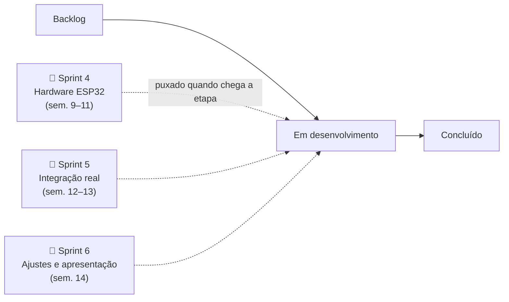
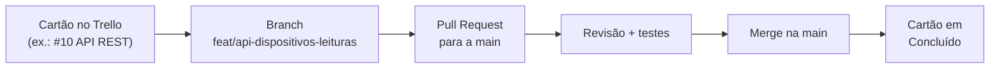
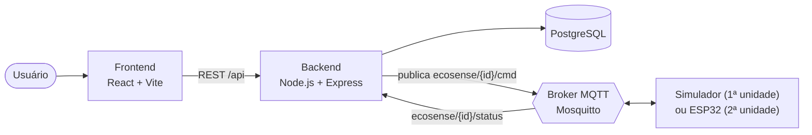
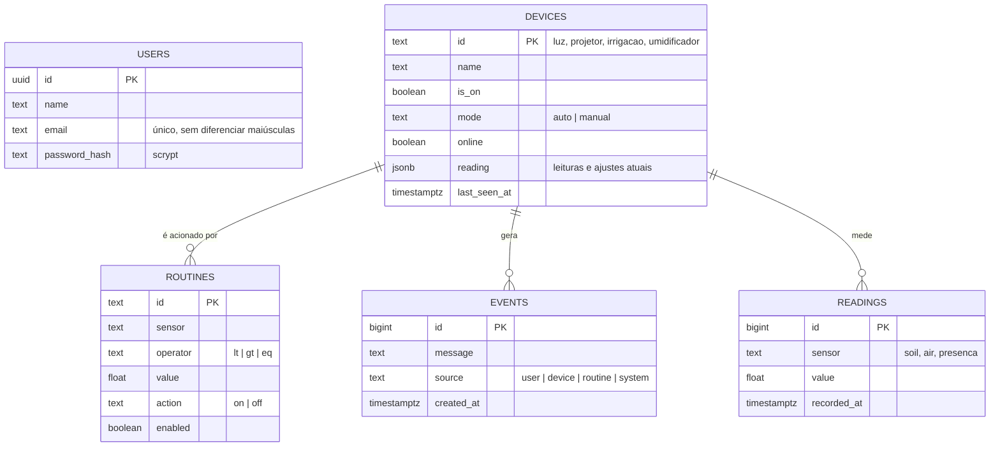
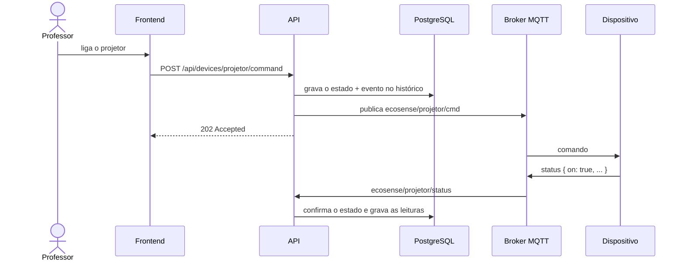

# EcoSense IoT

> Ambiente inteligente e sustentável para automação de espaços.

Plataforma web que controla, de um único painel, o **projetor** da sala (por
infravermelho), a **iluminação** por presença com desligamento automático, a
**irrigação** de um jardim pela umidade do solo e o **umidificador** pela
umidade do ar. O objetivo é reduzir o desperdício de energia e água em salas de
aula e ambientes compartilhados, onde hoje tudo depende de alguém lembrar de
desligar.

Este repositório é o **trabalho semestral de modelagem de software** da
disciplina de **Engenharia de Software** e foi organizado com o **método
Kanban** do começo ao fim: requisitos, modelagem, código e entregas passam
pelo mesmo quadro.

| | |
|---|---|
| **Instituição** | Universidade Tiradentes (UNIT), Ciência da Computação |
| **Disciplina** | Engenharia de Software, semestre 26.2 |
| **Professor** | Felipe dos Anjos |
| **Grupo** | GreenStack |
| **Quadro Kanban** | [Trello: EcoSense IoT — Engenharia de Software 26.2](https://trello.com/b/5gmTgNpX/ecosense-iot-engenharia-de-software-262) |

---

## Sumário

1. [Equipe](#equipe)
2. [Metodologia: Kanban](#metodologia-kanban)
3. [Andamento do quadro](#andamento-do-quadro)
4. [Modelagem do sistema](#modelagem-do-sistema)
5. [Requisitos e rastreabilidade](#requisitos-e-rastreabilidade)
6. [Como rodar](#como-rodar)
7. [Estrutura do repositório](#estrutura-do-repositório)
8. [Fluxo de Git](#fluxo-de-git)

---

## Equipe

Todos são desenvolvedores fullstack, mas cada um puxa principalmente os cartões
de uma frente, para o trabalho não se sobrepor.

| Integrante | Papel |
|---|---|
| Gabriel Araujo Rosas | Dev Fullstack |
| Gabriel Oliveira Cardoso | Dev Fullstack |
| João Gustavo Lima dos Santos | Dev Fullstack |
| Luiz Felipe de Araujo Meneses | Dev Fullstack |
| Guilherme Silva Gomes | Dev Fullstack |

Frentes de trabalho: **firmware/hardware** (ESP32, sensores), **backend**
(Node.js, MQTT, PostgreSQL), **frontend** (React, dashboard) e
**documentação, testes e integração**, esta última em rodízio.

---

## Metodologia: Kanban

O grupo usa **Kanban** como forma de organizar o trabalho, com algumas
cerimônias leves do Scrum (o que o documento de definição chama de
*Scrumban*): um encontro semanal de acompanhamento e entregas agrupadas por
etapa do cronograma. O motivo está no próprio documento do projeto: o grupo
trabalha e estuda à noite, então precisava de um método visual e flexível, em
que cada um **puxa** a próxima tarefa quando tem capacidade, em vez de receber
tarefas empurradas.

### O quadro

O quadro fica no Trello. Cada **cartão** é uma entrega pequena e verificável,
numerada (`#1`, `#2`...) e fatiada por frente. As colunas, na ordem do fluxo:



| Coluna | Significado |
|---|---|
| **Backlog** | Ideias e tarefas ainda não priorizadas |
| **Em desenvolvimento** | O que alguém já puxou e está fazendo agora |
| **🔧 U2 · Sprint 4 / 🔌 Sprint 5 / 🎤 Sprint 6** | Cartões já planejados para uma etapa futura da 2ª unidade. Ficam ali até a etapa começar e então vão para *Em desenvolvimento* |
| **Concluído** | Entregue: o código está na `main` (PR mergeado) ou o artefato de modelagem foi apresentado |

### Regras de trabalho

- **Puxar, não empurrar:** cada integrante escolhe o próximo cartão conforme a
  própria capacidade e se coloca como membro dele.
- **Um cartão, uma branch, um PR:** o cartão vira uma branch `feat/...`, que
  vira um Pull Request para a `main`. O cartão só vai para *Concluído* depois
  do merge (veja o [fluxo de Git](#fluxo-de-git)).
- **Prioridade pelo documento do projeto:** funcionalidades *Essenciais*
  antes das *Desejáveis*, e as *Futuras* só se sobrar tempo. Cartões de
  funcionalidade futura dizem isso na descrição.
- **O contrato MQTT vem primeiro:** foi um dos primeiros cartões concluídos
  (#3), porque é o que permite trocar o simulador pelo hardware real sem mexer
  no backend nem no frontend.

### Do cartão ao código



| Cartão | Branch | PR |
|---|---|---|
| #12 Setup do projeto React + tela de login | `feat/setup-do-frontend` | [#1](https://github.com/gabrielrosas28/EcoSense-IoT/pull/1) |
| #9 Simulador/mock dos sensores via MQTT | `feat/simulador-mqtt` | [#2](https://github.com/gabrielrosas28/EcoSense-IoT/pull/2) |
| #6 Setup do backend Node.js + Express | `feat/backend-node-express` | [#3](https://github.com/gabrielrosas28/EcoSense-IoT/pull/3) |
| #8 Configurar broker MQTT (Mosquitto via Docker) | `feat/broker-mqtt` | [#4](https://github.com/gabrielrosas28/EcoSense-IoT/pull/4) |
| #10 API REST: endpoints de dispositivos e leituras | `feat/api-dispositivos-leituras` | [#5](https://github.com/gabrielrosas28/EcoSense-IoT/pull/5) |

### Cronograma (etapas do documento de projeto)

O semestre tem duas unidades. A 1ª entrega o software completo com sensores
**simulados**; a 2ª troca o simulador pelo **hardware real**, mantendo o mesmo
contrato MQTT.

| Unidade | Etapa | Entrega | Semanas |
|---|---|---|---|
| 1ª: software com mock | 1 | Requisitos, arquitetura, contrato MQTT, protótipo de telas | 1–3 |
| | 2 | Backend + simulador publicando via MQTT | 4–6 |
| | 3 | Dashboard integrado, automações sobre os dados simulados | 7–8 |
| 2ª: hardware | 4 | ESP32 com sensores/atuadores e firmware nos mesmos tópicos | 9–11 |
| | 5 | Troca do mock pelo hardware e testes ponta a ponta | 12–13 |
| | 6 | Ajustes, documentação e apresentação | 14 |

---

## Andamento do quadro

*Retrato do quadro em 06/10/2026: 29 cartões, 14 concluídos. O estado atual
está sempre no [Trello](https://trello.com/b/5gmTgNpX/ecosense-iot-engenharia-de-software-262).*

| Coluna | Cartões |
|---|---|
| **Concluído (14)** | #1 Levantamento de requisitos (RF e RNF) · #2 Definir arquitetura do sistema · #3 Contrato de mensagens MQTT · #4 Protótipo de telas (Figma) · #5 Setup do repositório + estrutura de pastas · #6 Setup do backend Node.js + Express · #7 Modelar e criar banco PostgreSQL · #8 Broker MQTT (Mosquitto via Docker) · #9 Simulador dos sensores via MQTT · #10 API REST de dispositivos e leituras · #11 Autenticação com hash de senha · #12 Setup do React + tela de login · #13 Dashboard com cards dos dispositivos · #30 Diagrama UML e especificação de casos de uso |
| **Em desenvolvimento (4)** | #14 Gráficos de umidade + controles manuais · #15 Lógica de automação sobre dados mockados · #28 Notificações/alertas *(futura)* · #29 Modo agendamento *(futura)* |
| **🔧 Sprint 4: Hardware ESP32 (5)** | #17 Comprar componentes · #18 Circuito da sala (IR + PIR + relé) · #19 Circuito do jardim (solo + bomba + relé) · #20 Capturar códigos IR do projetor · #21 Firmware ESP32 com MQTT |
| **🔌 Sprint 5: Integração real (3)** | #22 Substituir o mock pelo ESP32 · #23 Teste de integração ponta a ponta · #24 Calibrar sensores e tratar reconexão |
| **🎤 Sprint 6: Ajustes e apresentação (3)** | #25 Documentação final + diagrama de arquitetura · #26 Testes finais e correção de bugs · #27 Preparar e ensaiar a apresentação |

---

## Modelagem do sistema

Os artefatos de modelagem saíram dos cartões da etapa 1: requisitos (#1),
arquitetura (#2), contrato MQTT (#3), protótipo de telas no Figma (#4), modelo
do banco (#7) e diagrama UML com a especificação de casos de uso (#30). Os
diagramas abaixo descrevem o sistema como ele está implementado neste
repositório.

### Arquitetura

O frontend nunca fala MQTT: só conversa com a API. A API é a ponte entre o
painel e os dispositivos, e o simulador ocupa o lugar do ESP32 até o hardware
chegar.



### Contrato MQTT

Um só contrato para o simulador e para o firmware. Por isso a troca na 2ª
unidade é *plug-and-play*. `<id>` é `luz`, `projetor`, `irrigacao` ou
`umidificador`.

| Direção | Tópico | Payload | QoS |
|---|---|---|---|
| API → dispositivo | `ecosense/<id>/cmd` | `{ "action": "power", "value": "on" }` | 1, sem reter |
| dispositivo → API | `ecosense/<id>/status` | `{ on, mode, online, ...leituras }` | 1, retido |
| broker → API (Last Will) | `ecosense/<id>/status` | `{ "online": false }` | 1 |

Os detalhes estão em [`simulator/README.md`](simulator/README.md).

### Modelo de dados



### Comando do painel (sequência)



---

## Requisitos e rastreabilidade

Requisitos do documento de definição do projeto, ligados aos cartões do quadro
e ao que já existe no código.

✅ atendido · 🟡 parcial · ⏳ planejado

### Funcionais

| Código | Requisito | Cartão | Situação |
|---|---|---|---|
| RF01 | Login com e-mail e senha | #11, #12 | ✅ API com JWT + tela de login |
| RF02 | Dashboard com o status de cada dispositivo em tempo real | #13 | 🟡 dashboard pronto; falta o WebSocket de tempo real |
| RF03 | Ligar/desligar o projetor por infravermelho | #20, #21 | 🟡 comando `ir` na API e no simulador; falta o emissor IR real |
| RF04 | Desligar a luz após um tempo configurável sem presença | #15 | 🟡 automação no simulador (`sleepMin`); falta o firmware |
| RF05 | Irrigar quando a umidade do solo ficar abaixo do limite | #15 | 🟡 automação no simulador (`threshold`); falta o firmware |
| RF06 | Ligar o umidificador quando a umidade do ar ficar abaixo do limite | #15 | 🟡 automação no simulador (`threshold`); falta o firmware |
| RF07 | Configurar limites de umidade e tempo de sleep | — | ✅ comandos `threshold`/`config` validados pela API |
| RF08 | Registrar e exibir o histórico das leituras | #10, #14 | 🟡 histórico gravado e servido pela API; faltam os gráficos |

### Não funcionais

| Código | Requisito | Situação |
|---|---|---|
| RNF01 | Status no dashboard em até 3 s | ⏳ depende do WebSocket |
| RNF02 | Comunicação dispositivo ↔ servidor por MQTT | ✅ Mosquitto + ponte MQTT na API |
| RNF03 | Senhas guardadas com hash | ✅ scrypt, nunca a senha em texto |
| RNF04 | Automações locais continuam com a conexão caída | 🟡 automações rodam no dispositivo e a API reconecta sozinha; validar no ESP32 (#24) |
| RNF05 | Interface responsiva (celular e desktop) | ✅ layout com breakpoints de 1100, 860 e 560 px |

---

## Como rodar

Pré-requisitos: **Node.js 22.18+** e **Docker** (para o PostgreSQL e o
Mosquitto). Cada parte roda em um terminal:

```bash
# 1. Backend: banco + broker + API em http://localhost:3000/api
cd backend
npm install
cp .env.example .env
docker compose up -d
npm run db:migrate && npm run db:seed
npm run dev

# 2. Simulador: faz o papel do ESP32
cd simulator
npm install
npm start

# 3. Frontend: painel em http://localhost:5173
cd frontend
npm install
npm run dev
```

Login de desenvolvimento: **admin@ecosense.local** / **ecosense123**.

Sem Docker, o backend sobe um PostgreSQL embutido com `npm run db:local`. O
passo a passo completo, as rotas e as variáveis de ambiente estão no
[`backend/README.md`](backend/README.md).

---

## Estrutura do repositório

```
EcoSense-IoT/
├── frontend/    painel React + Vite (dashboard, telas de cada dispositivo, rotinas)
├── backend/     API Node.js + Express + PostgreSQL, ponte MQTT, testes
└── simulator/   simulador dos sensores em TypeScript (substitui o ESP32 na 1ª unidade)
```

| Camada | Tecnologia |
|---|---|
| Frontend | React, Vite, Zustand, Recharts |
| Backend | Node.js, Express 5, Zod, JWT |
| Banco | PostgreSQL 17 (PGlite nos testes) |
| IoT | MQTT com Mosquitto; ESP32 com DHT22, sensor de solo capacitivo, PIR, LED IR e relés |
| Testes | Vitest + Supertest com banco e broker reais em memória |
| Organização | Trello (Kanban), Git + GitHub |

---

## Fluxo de Git

- `main` é a branch estável. Nada entra sem Pull Request.
- Uma branch por cartão do quadro: `feat/<assunto>` para funcionalidades,
  `docs/<assunto>` para documentação.
- Commits no padrão *Conventional Commits*, em português:
  `feat(backend): ...`, `docs(backend): ...`, `chore(...): ...`.
- O PR descreve o que mudou e como foi testado. Depois do merge, o cartão vai
  para *Concluído* no Trello.
